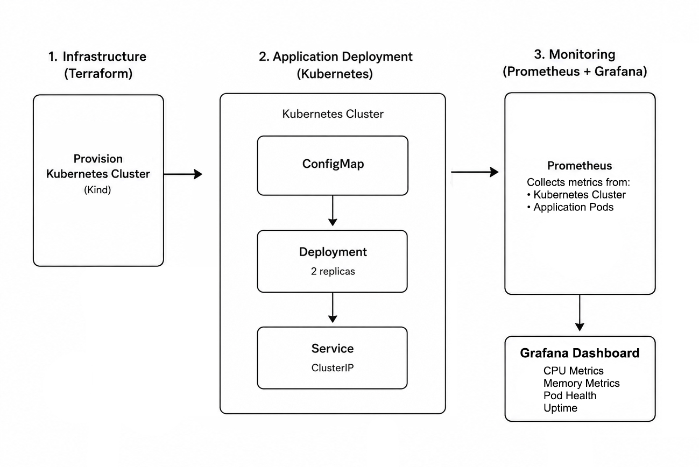
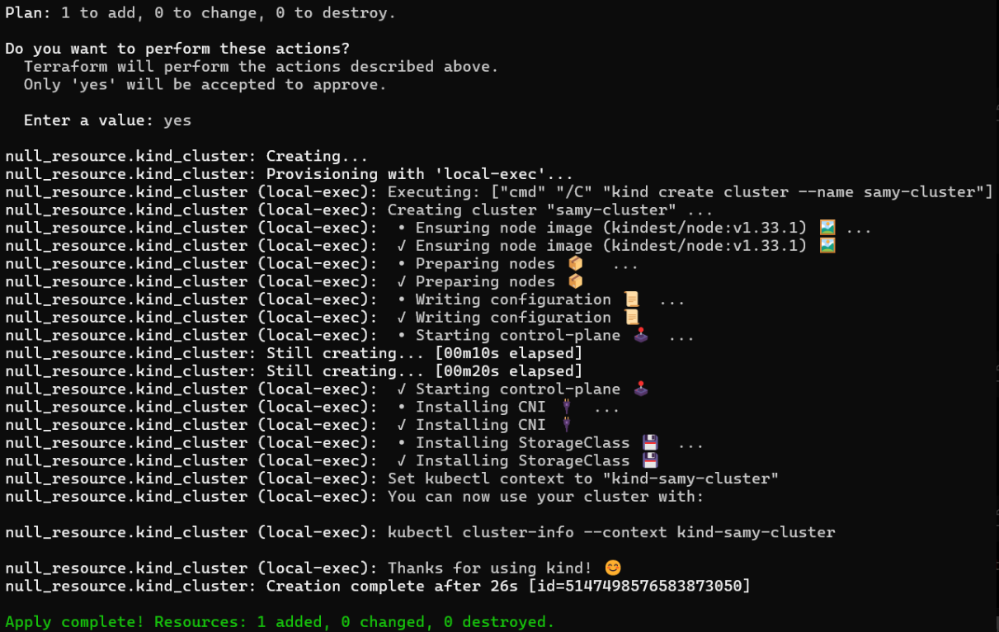
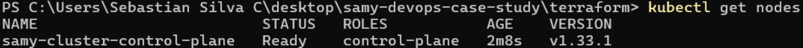
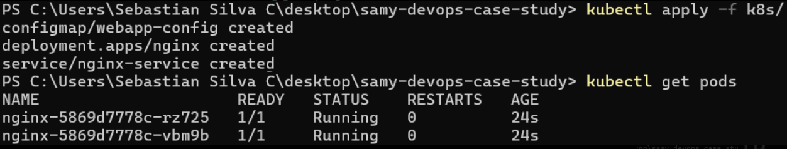
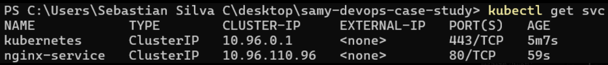
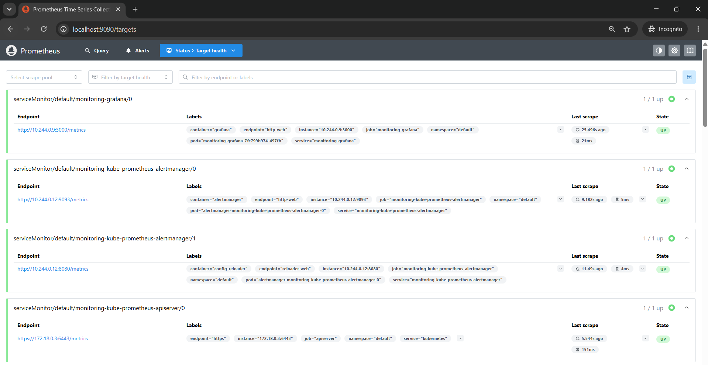
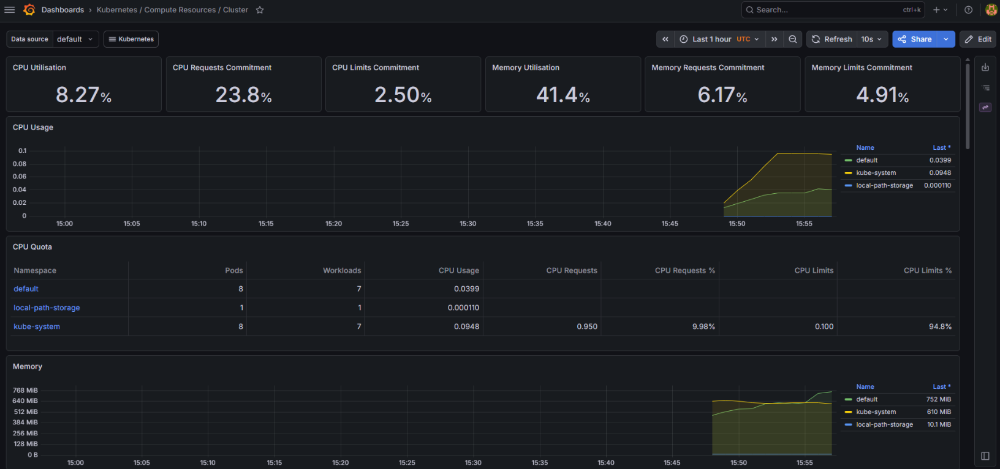

# SAMY DevOps Engineer Case Study

This project demonstrates the deployment of a Kubernetes-based web application using Infrastructure as Code and monitoring.

Components:

- Terraform
- Kind Kubernetes
- Nginx
- ConfigMap
- Prometheus
- Grafana

---

## Repository Structure

```text
samy-devops-case-study/

README.md

docs/
└── architecture.png

terraform/
├── main.tf
├── providers.tf
└── versions.tf

k8s/
├── configmap.yaml
├── deployment.yaml
└── service.yaml

screenshots/
├── terraform-apply.png
├── kubectl-get-nodes.png
├── kubectl-get-pods.png
├── kubectl-get-svc.png
├── prometheus-targets.png
└── grafana-dashboard.png
```

---

## Architecture



---

## Architecture Flow

```text
Terraform
    ↓
Kind Kubernetes Cluster
    ↓
ConfigMap
    ↓
Deployment (2 replicas)
    ↓
Service (ClusterIP)
    ↓
Prometheus
    ↓
Grafana
```

---

## Design Decisions

### Terraform

Terraform is used to provision a local Kind Kubernetes cluster.

Kind was selected because it provides a lightweight Kubernetes environment suitable for local deployment and rapid testing.

### Kubernetes

The application is deployed using:

- ConfigMap: provides application configuration.
- Deployment (2 replicas): ensures application availability through multiple replicas.
- ClusterIP Service: provides stable internal networking.

### Monitoring

Prometheus collects metrics from Kubernetes components and application pods.

Grafana visualizes:

- CPU usage
- Memory usage
- Pod health
- Uptime

--- 

## Deployment

### Terraform

```bash
terraform init
terraform apply
```

### Kubernetes

```bash
kubectl apply -f k8s/
```

### Monitoring

```bash
helm install monitoring prometheus-community/kube-prometheus-stack
```

---

## Deployment Screenshots

### Terraform Apply

Terraform successfully provisioned the Kind Kubernetes cluster.



---

### Kubernetes Cluster

The Kubernetes control plane was successfully created and reached Ready state.



---

### Application Deployment

The Nginx deployment was deployed with two replicas.



---

### Service Exposure

A ClusterIP service provides internal access to the application.



---

### Prometheus Monitoring

Prometheus successfully discovered and scraped cluster targets.



---

### Grafana Dashboard

Grafana visualizes cluster resource consumption and health metrics.



---

## Production Improvements

For a production environment I would:

- Replace Kind with EKS
- Implement CI/CD pipelines for automated deployments
- Add TLS certificates
- Use external secrets management
- Configure alerting
- Implement high availability
- Add persistent storage

---

## Conclusion

This project demonstrates a complete DevOps workflow using Infrastructure as Code, Kubernetes application deployment and monitoring. The implementation prioritizes simplicity, reproducibility and operational visibility while remaining extensible toward a production-grade platform.
